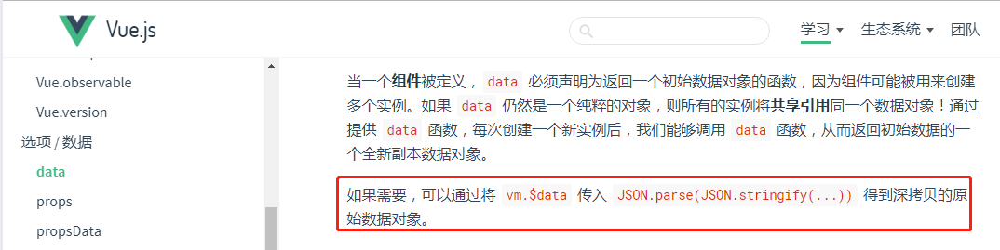

 &emsp;&emsp;今天代码rv的时候，审核人说不能直接修改父组件传的值，我代码里写的是 data() {return {commonForm: form}},然后通过修改commonForm的值，最后提交的也是commonform。按照常理来说，我改变commonForm确实form也会改变，但是我想起来我写了不少代码都是这种操作，但是控制台也没有警告说我修改了父组件的值，此时我以为Vue中的data函数会对数据进行深拷贝。结果后面在父组件进行监听，当加上deep:true时，发现子组件的commonForm进行修改时，父组件也会被修改，但是当没有加上deep:true时，则监听不到，由此推断出控制台监听的那种是默认为deep:false的，这种情况下，只有改变this.form对象的地址，控制台才会报错。由于这种操作确实改变了父组件的值，违反了单向数据流，所以需要使用深拷贝！！
 &emsp;&emsp;
