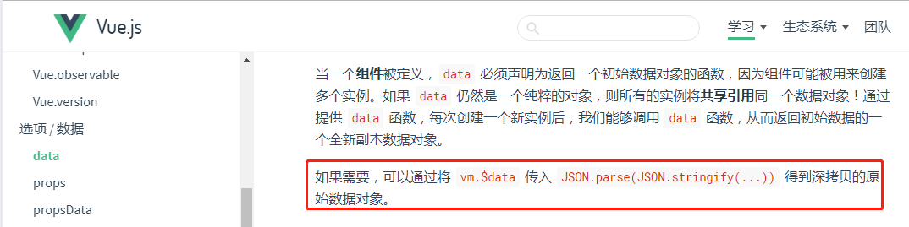

 &emsp;&emsp;今天代码rv的时候，审核人说不能直接修改父组件传的值，我代码里写的是 data() {return {commonForm: form}},然后通过修改commonForm的值，最后提交的也是commonform。按照常理来说，我改变commonForm确实form也会改变，但是我想起来我写了不少代码都是这种操作，但是控制台也没有警告说我修改了父组件的值。结果查了vue的文档，说是data函数会对数据进行深拷贝。因为我们不需要再额外地进行处理了。
 &emsp;&emsp;
