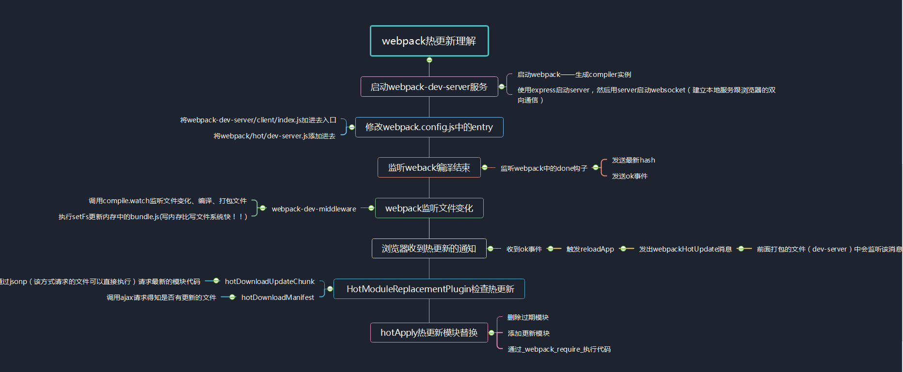
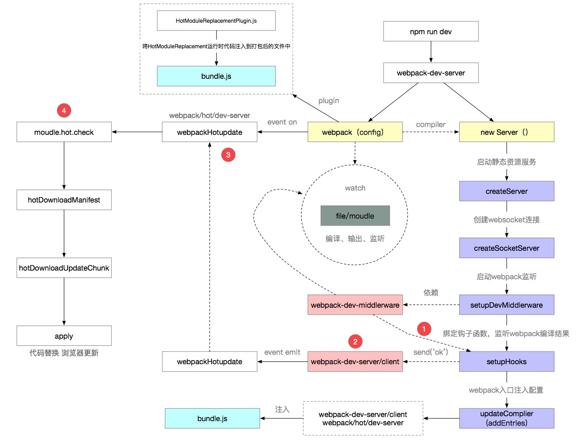

 &emsp;&emsp;今天学习了webpack-dev-server热更新的原理，大致的意思就是借助express启动的websocket让浏览器跟本地服务器建立双向的通信，然后通过webpack的compile的watch功能，监听文件的改变，然后通过websocker告诉浏览器最新的hash以及触发ok事件，触发ok事件之后，会通过webpack去检查更新的内容，从而去决定是reload还是进行模块替换，如果要模块替换，就调用hotApply函数进行新旧模块代码的替换，然后结合_webpack_require_去执行代码。因为这一切都涉及到当前运行环境，所以需要一开始时将websocket跟dev-server的代码塞进去bundle中，让客户端中也能执行这一块的代码。
&emsp;&emsp;另外两个需要注意的点就是：
（一）获取当前更新模块id时，是通过jsonp，可以立即直接脚本
（二）当webpack监听到文件变化之后，是写进内存而不是写进文件系统，这样可以加快速度。
自己理解画的图：

掘金跟知乎上的图：

