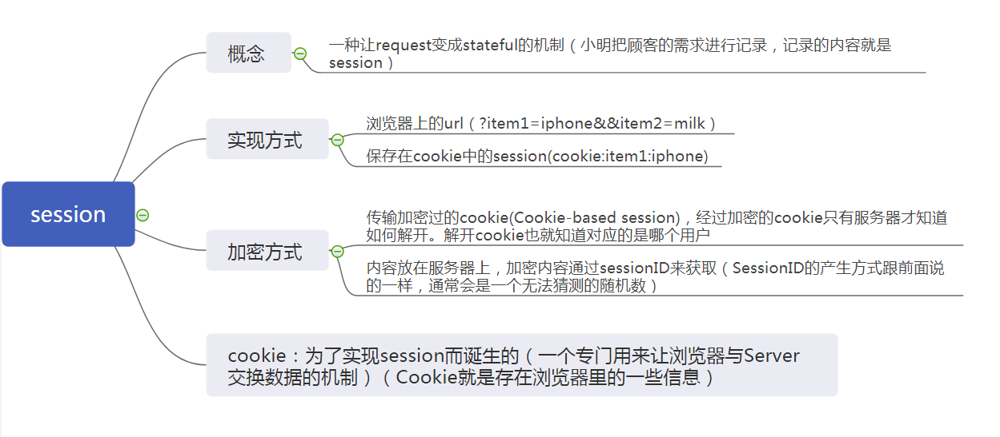

 &emsp;&emsp;今天趁着坐地铁的时间阅读了一篇文章，关于理解session的，个人觉得讲的还不错，于是进行一个小结。文章通过故事的形式阐述了session的概念，同时讲到一些客户端与服务端通信时有关安全方面的问题。
 &emsp;&emsp;这个故事讲述了一个没有记忆力的小明开了杂货铺，通过用笔记本电脑记录用户信息的故事。安全相关——其中一种方式是笔记本电脑记录的信息就相当于session，每次用户来的时候通过提供小明随机提供的sessionID，小明通过该id在笔记本中找到对应的记录，从而找到顾客消费的信息，从而更好的服务客户。另外一种方式是小明通过解密加密过的cookie直接得到客户信息，但是这种方式会使得客户保存过长的cookie，不是非常好。

