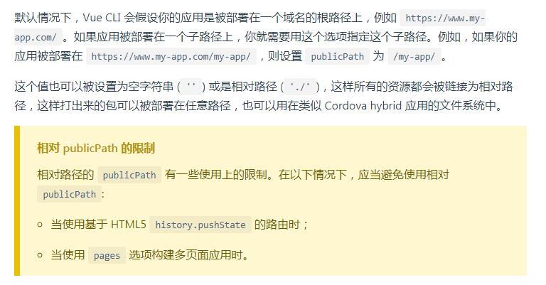

&emsp;&emsp;今天在项目中添加登陆功能之后，我发现第一次点击切换路由时是正常的，之后再切换时就会报错（loading chunk xx failed）一番搜索之后找到原因出在vue.config.js中的BASE_URL配置，当其在development时配置的是'./',去vue-cli官网看了下原来在history路由模式下，BASE_URL是不能采用相对路径的形式进行配置的。

