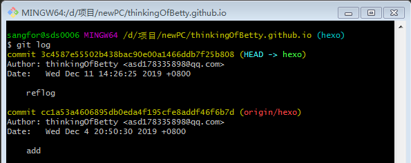
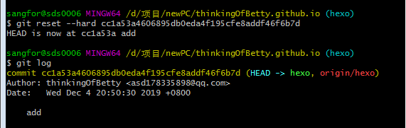
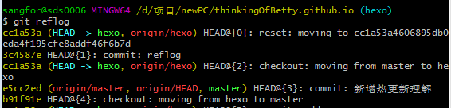
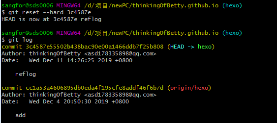

&emsp;&emsp;依旧记得之前的一次reset --hard给我造成的心理阴影，要是早点get到这个点，或许当初会少些焦虑。
接下来还原一下reset --hard之后的场景以及记录下修复时需要用到什么指令。

首先用git log查看当前的commit记录

然后用git reset --hard来强制回退commit，此时再用git log查看了之前的reflog的提交记录已经不见了

此时如果要重新找回reflog的commit，需要用git reflog查看你在git上进行的每一步操作，然后找到之前的reflog的hash，再用git reset --hard 回退到丢失的commit。此时如果后面有新的commit，可以结合git cherry-pick来使用

此时查看commit已经成功拾回。
